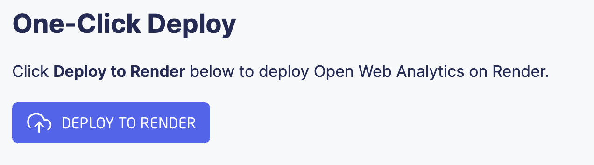
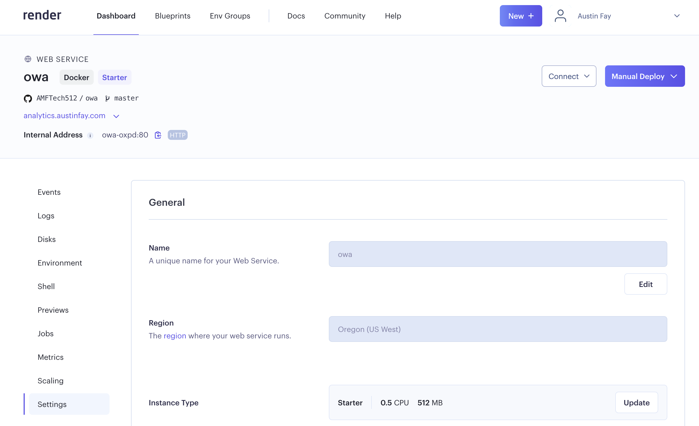
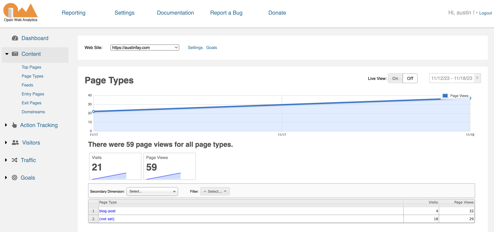
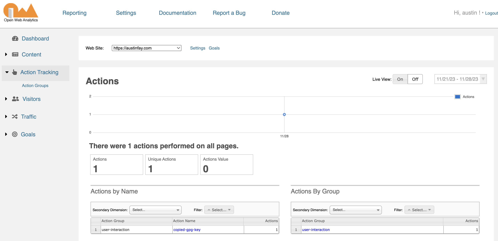

Hello! This is my attempt at starting a blog. If there is at least one post after this, then you know that it was at least somewhat of a success.

I have two main reasons for starting this blog. The first is reputation. I opted to drop out of college after only my first year. I did this partly because I was offered a job, but also because I didn't believe that a Computer Science degree would provide me with much value besides the piece of paper that says I know stuff. Up until I attended college, everything I knew about computers had been self-taught. I did it out of curiosity and passion, and I even started working professionally before I attended college. Am I saying that Computer Science is a useless degree and that no one should do it? No. For someone who is genuinely new to the field, a Computer Science degree teaches you the fundamentals that you need to be successful. For me, I already had a solid understanding of the fundamentals, and even had experience working with specific technologies (mostly web), so I had to consider if the additional knowledge I'd gain from going to college was worth the hefty price tag. I knew that there were classes that could be useful, such as Data Science, Robotics, and some other electives, but I knew that I would have to take them with other classes that were not necessary or relevant for me, such as physics, biology, and chemistry. Considering all of that, and the fact that I had been offered a job during my first year, I decided that for me, college was not worth the hefty price tag. So I made the bet that I could be successful without it. However, if you don't have a piece of paper that says you know stuff, you have to demonstrate your knowledge and skills in other ways. Hence, I'm starting this blog.

The second reason for starting this blog is to build a repository of knowledge. I'm constantly learning things, and inevitably after enough time has passed, I forget what I have learned. I would like be able to go back and reference things that I have done and things that I learned along the way. By making it public, I have the added benefit of being able to share it with other people.

With all of that said, it's time to get into the meat of this blog post. Since these blog posts are about documenting how I did things, this blog post will be about creating this blog. So let's get started.

# Picking the tech stack

The first thing I had to consider is whether to use a blogging platform like [medium.com](https://medium.com) (or the decentralized version, [paragraph.xyz](https://paragraph.xyz)), or build off of my own website. While the ease of getting started with a platform like medium was attractive, I also feared what might happen if I entrusted my life's work to a platform that I didn't know the future of. What if I decide that I don't want to use medium anymore? Maybe they change their pricing or their interface in such a manner that I don't like? All of my content would be stuck there, and moving it out would be a pain. To be clear, these problems aren't unique to medium; any blogging platform would have the same problems. Considering these concerns, I decided that I want my blog articles to be written in markdown files. Markdown files are simple, the format is widely recognized and portable, meaning that I can use a vareity of different tools and technologies to display them, and I can store them wherever I want. By choosing to write my blog articles in markdown, I'm not locking myself into anything.

By the time I had started building the blog, I had already started building my personal website using [11ty](https://www.11ty.dev/). I decided to use 11ty because it was the easiest for me. Configuration files are written in JSON, templates can be written in a variety of different templating languages, it uses npm for its tooling (though I opted to use [bun](https://bun.sh)), and most importantly, it easily converts mardown files into html files using your templates. I didn't think it was worth using some fancy framework like Next or Nuxt because I figured that everything would be statically generated, and if I need a fancy UI framework, I can just include it later. The goal with this site is to keep it stupid simple.

To host the the actual site, I opted to use [Netflify](https://netlify.com). This goes along with the theme of simplicity for this project. All you have to do to get started is upload a folder with static files, and Bob's your uncle. Netlify also has a build feature that allows you to run a build script when you push to a git repository (a feature that I ended up utilizing), but we'll get into that later.

# Getting started with 11ty

The cool thing about 11ty is that you can start using it without any configuration. The program simply scans your current directory for any source files, builds them into html files, and puts them in a directory called `_site`.

In order to use 11ty, you have to somehow get its npm package. I'm using [bun](https://bun.sh) because I'm cool 😎, but you could also use [npm](https://npmjs.com) or [yarn](https://yarnpkg.com).

The first thing I tried was creating an `index.md` file in the root and placing the following contents inside of it:

```md
# Intro

Hello, world!
```

Then after running `bunx @11ty/eleventy`, it generated a file `_site/index.html` with the following contents:

```html
<h1>Intro</h1>
<p>Hello, world!</p>
```

If you want to use a custom layout, put it in the `_includes` directory. I created a file called `_includes/home-layout.hbs` with the following contents:

```handlebars
<html>
  <head>
    <title>Hello world</title>
  </head>

  <body>
    <h1>Cool site</h1>
    <main>\{{{ content }}}</main>
  </body>
</html>
```

The important part here is that `\{{{ content }}}` tells handlebars to render the content of the markdown file in raw html. The next step is to modify the markdown file to tell 11ty to use the layout. I modified `index.md` to look like this:

```markdown
---
layout: home-layout.hbs
---

# Intro

Hello, world!
```

Now when I run `bunx @11ty/eleventy`, it generates the following html file:

```html
<!DOCTYPE html>
<html>
  <head>
    <title>Hello world</title>
  </head>

  <body>
    <h1>Cool site</h1>
    <main>
      <h1>Intro</h1>
      <p>Hello, world!</p>
    </main>
  </body>
</html>
```

Neat, huh?

# Setting up the project

Like I demonstrated above, you can technically run 11ty by itself with just a collection of source files and no configuration. However, there are more advanced things I'd like to do with this project such including installing dependencies and defining build scripts. For that, I created an npm package (using bun) and installed 11ty as a dependency. To do this, I simply ran

```sh
bun init
```

This created a bunch of files, including a `package.json` file, a tsconfig, a gitignore, a readme, and a starter `index.ts` file. Since I'm not actually writing a Typescript program, I deleted the `index.ts` file, but all of the rest of the files were useful. 

The next step was to set up 11ty. I did this by simply running
  
```sh
bun install @11ty/eleventy
```

Then I added a couple of helper scripts to my `package.json` file for building and testing the site:

```json
{
  // ...
  "scripts": {
    "build": "eleventy",
    "dev": "eleventy --serve"
  }
  // ...
}
```

Now I can run `bun run build` to build the site, and `bun run dev` to build the site and serve it locally.

# Setting up the content directory

I want all of the content for this site (the markdown files) to live in its own directory and be separated from the rest of the code. That way, if I ever want to migrate the content to a different site or platform, I can do so easily. To do this, I had to define an 11ty config file `eleventy.config.js`.

```js
module.exports = function (eleventyConfig) {
  return {
    dir: {
      input: "content",
    },
  };
};
```

Now in my site, I have a `content` directory. All source files (markdown, handlebars, html) can live in there and 11ty will use them to build the site.

# Deploying to Netlify

Since I turned the site into an npm package, it is super easy to configure Netlify to build and deploy it. After creating a new site in Netlify and linking it to my Github repository, I added the following `netlify.toml` file
  
```toml
[build]
  publish = "_site"
  command = "bun run build"
```

Now whenever I push to the master branch of the repository, Netlify automatically runs the build script and deploys the site. That makes it super easy to update the site!

# Setting up Vite and Sass

Even though CSS has gotten a lot of new features in the recent months, I still prefer to use [Sass](https://sass-lang.com/) because it has a few more features that I really like using (mainly nested selectors). Unfortunately, in order to use Sass, you need to somehow include the Sass compilation to the build step. This is usually done in a bundler, such as [Vite](https://vitejs.dev/). In addition to processing our Sass files, Vite will also allow us to easily bundle any frameworks (like [Vue](https://vuejs.org/)) for any pages that need it.

Fortunately, there is an 11ty plugin called [eleventy-plugin-vite](https://github.com/11ty/eleventy-plugin-vite) that uses Vite to post-process the files that 11ty generates. Getting it set up is easy. First, install the plugin:

```sh
bun install @11ty/eleventy-plugin-vite
```

Then create a `eleventy.config.js` file with the following contents:

```ts
const EleventyVitePlugin = require("@11ty/eleventy-plugin-vite");

module.exports = function (eleventyConfig) {
  eleventyConfig.addPlugin(EleventyVitePlugin);
};
```

To get Sass working, simply install the `sass` package:

```sh
bun install sass
```

That's it! Now you can write `.sass` and `.scss` files and include them directly into your templates.

# Fixing the 'public' directory

With Vite, you can normally specify a `public` directory that contains static assets that you want to be copied over to the build directory. However, since we're using 11ty, we don't have a `public` directory. Also, I want to consolidate all of the files that I want Vite to process into a `src` directory. We can do that by adding the following to our 11ty config:

```ts
module.exports = function (eleventyConfig) {

  // ...

  // Copy the contents of the `public` folder to the output folder
  // For example, `./public/css/` ends up in `_site/css/`
  eleventyConfig.addPassthroughCopy({
    "./public/": "/public/",
    "./src/": "/"
  });

  // ...

}
```

This makes it so that after 11ty builds the site, everything will be in the root except for the files in the public directory, which will be in a directory called `public`. This means that Vite will process everything in the root, and everything in the `public` directory will be copied to the root of the site directory that it generates. Don't worry if that doesn't make a ton of sense 😅; just know that it works.

I also want to copy any images and media assets that we put inside of our content directory. This makes it so that, for example, I can put `image.png` in the folder for a blog post, and in the blog post, I can simply render it with ``. To do this, I added the following to my 11ty config:

```ts
// Copy all images directly
eleventyConfig.addPassthroughCopy("**/*.jpg");
eleventyConfig.addPassthroughCopy("**/*.png");
eleventyConfig.addPassthroughCopy("**/*.gif");
eleventyConfig.addPassthroughCopy("**/*.svg");
```

# Configuring syntax highlighting

A lot of my blog articles are going to include code samples. For those, I want syntax highlighting so that they're easy to read. For this, I'm using [Prism](https://prismjs.com/). To get it working, I first installed the `prismjs` package:

```sh
bun install prismjs
```

Then I created a script to load the Prism library and initialize it:

```ts
// scripts/prism.ts

import Prism from "prismjs";

// if you are intending to use Prism functions manually, you will need to set:
Prism.manual = true;

Prism.highlightAll();
```

Then in my template, I included the script:

```html
<!-- _includes/blog-post-layout.hbs -->
<script type="module" src="/scripts/prism.ts"></script>
```

I also installed the [vite-plugin-prismjs](https://github.com/code-farmer-i/vite-plugin-prismjs) Vite plugin so that I could configure it with Vite. I modified my `eleventy.config.js` file to look like this:
```js
const EleventyVitePlugin = require("@11ty/eleventy-plugin-vite");
const VitePrismPlugin = require("vite-plugin-prismjs").default;

module.exports = function (eleventyConfig) {
  // ...

  // Add the Vite plugin
  eleventyConfig.addPlugin(EleventyVitePlugin, {
    viteOptions: {
      plugins: [
        VitePrismPlugin({
          languages: [
            "markup",
            "markdown",
            "handlebars",
            "css",
            "shell",
            "clike",
            "javascript",
            "typescript",
          ],
          theme: "okaidia",
          css: true,
        }),
      ],
    },
  });

  // ...
};
```

Now all of my code has pretty syntax highlighting. Yay!

# Adding features to the markdown parser

It's pretty convenient that all you have to do to render markdown files is to include `\{{{ content }}}` somewhere in your template. The only unfortunate part about that is that it doesn't offer much flexibility when it comes to *how* the content is rendered. There are a couple of things that I want to do with the content of the markdown files:

1. Make all external links open in a new tab
2. Make all headings have an anchor link that can be used to link to that heading

To do this, I consulted [Phind](https://phind.com), which is just a wrapper around ChatGPT. It gave me the following answer.

11ty uses [markdown-it](https://github.com/markdown-it/markdown-it) under the hood, so to configure it, we have to start by installing it as a dependency of our project:

```sh
bun install markdown-it
```

Then we have to define custom plugins for it. Phind wrote the following plugin for me that I saved in `markdown-it-plugins.js`:

```js
function markdownItExternalLinks(md) {
  const defaultRender = md.renderer.rules.link_open || function(tokens, idx, options, env, self) {
    return self.renderToken(tokens, idx, options);
  };

  md.renderer.rules.link_open = function (tokens, idx, options, env, self) {
    const token = tokens[idx];
    const hrefIndex = token.attrIndex('href');
    if (hrefIndex >= 0) {
      const hrefAttr = token.attrs[hrefIndex];
      const url = hrefAttr[1];
      if (url && !url.startsWith('/') && !url.startsWith('#')) {
        token.attrPush(['target', '_blank']);
        token.attrPush(['rel', 'noopener noreferrer']);
      }
    }
    return defaultRender(tokens, idx, options, env, self);
  };
}

module.exports = {
  markdownItExternalLinks
}
```

Fortunately, for converting all headings into links, there's already a community plugin for that called [markdown-it-anchor](https://github.com/valeriangalliat/markdown-it-anchor). Using it was as simple as installing it:

```sh
bun install markdown-it-anchor
```

Now we have to configure 11ty to use these plugins. To do that, I modified my `eleventy.config.js` file to look like this:

```js
const { markdownItExternalLinks } = require("./markdown-it-plugins");
const markdownIt = require("markdown-it");
const markdownItAnchor = require("markdown-it-anchor");

module.exports = function (eleventyConfig) {
  // ...

  // configure custom md parser
  const md = markdownIt({
    html: true,
    breaks: true,
    linkify: true
  });
  
  // use md plugins
  md.use(markdownItExternalLinks);
  md.use(markdownItAnchor, {
    permalink: true,
    permalinkClass: 'direct-link',
    permalinkSymbol: '#'
  });
  
  eleventyConfig.setLibrary('md', md);

  // ...
};
```

Now all of my external links upen up with new tabs, and all of my headings have anchor links!

# Setting up analytics

I want to be able to know how many people are visiting my site, so I need some kind of way to track analytics. To be honest, when I started trying to implement analytics, I didn't know of any analytics platform except Google Analytics. So, naturally, that was the first thing I tried to set up. Unfortunately, I ran into a couple of issues with Google Analytics. One, it's super complicated 😅. I barely understand how it works, and all of the dashboards seem confusing to me. Second, it gets defeated by browsers that block trackers and third party cookies. I was too lazy to do serious research on different analytics platforms, but there was one that stood out to me: [Open Web Analytics](https://www.openwebanalytics.com/). This is an open-source, self-hosted project on Github. I was trying to avoid self-hosting anything since it's really easy to get in the weeds with self-hosting, but they have an easy [blueprint](https://github.com/render-examples/open-web-analytics) already configured for [Render](https://render.com). Even though I had just stumbled across it and was still a little skeptical of how well it would work for me, it has the following clear advantages:

- It's open source
- I could host it for $14/month regardless of how many sites I have and how much traffic they get
- It's relatively easy to set up with Render
- It would be on the same domain as my main site, so it wouldn't be blocked by browsers that block trackers and third party cookies
- It's way less complicated than Google Analytics (and some other analytics platforms)

Setting it up was fairly easy, but I got hung up on a couple of things, So I'll document them here.

### Don't use their repo for the blueprint; clone the template

It's tempting to click this button.



But in doing so, you lose the ability to modify the config. This is especially bad, because at the time of writing this, it wasn't event set up to use the latest version of OWA. Instead, you should clone the template.

Then I modified the [Dockerfile](https://github.com/render-examples/open-web-analytics/blob/be66507ea8e2bf285b8769bda7fa1e0807486aca/Dockerfile#L9) to use the latest version of OWA (which at the time of writing this was 1.7.8):

```dockerfile
# Dockerfile

# ...

ENV OWA_VERSION=1.7.8

# ...
```

Then in the Render dashboard, go to the "Blueprints" tab and select "New Blueprint Instance." From there, connect the repository you created and allow Render to deploy it. It'll deploy an instance of the PHP application and an instance of MySQL.

### Setting up a custom domain

Render deploys the PHP application as a "Web Service" that has a public facing URL. I followed the instructions [here](https://render.com/docs/custom-domains#configuring-dns-to-point-to-render), but basically all you have to do is 1) add a CNAME record to your DNS configuration that points to the Render URL, and 2) configure your custom domain in the Render dashboard by going to Settings > Custom Domains for the PHP web service. The last important step is to create an environment variable called `PUBLIC_URL` for the PHP web service. This should be the URL that you want to use for your analytics. For example, I set mine to `https://analytics.austinfay.com`. Make sure you don't add a slash at the end; it will add one for you. Setting this environment variable is important because otherwise OWA will redirect to the Render URL instead of your custom domain. Once you make this change, redeploy the PHP web service by clicking "Manual Deploy."



At this point, you should be able to go to your custom domain and see the OWA dashboard.

### Setting up the tracking script

Upon visiting your OWA dashboard for the first time, it will prompt you to add your first site and create your first account. Once you do that, it will give you a tracking script that you can add to your site. I added mine to the `head` of my site's template. It should look something like this:

```html
<!-- Start Open Web Analytics Tracker -->
<script type="text/javascript">
  //<![CDATA[
  var owa_baseUrl = 'https://analytics.austinfay.com/';
  var owa_cmds = owa_cmds || [];
  owa_cmds.push(['setSiteId', '8971c79f5fff28491209f91174a0c5b6']);
  owa_cmds.push(['trackPageView']);
  owa_cmds.push(['trackClicks']);
  owa_cmds.push(['trackDomStream']);

  (function() {
      var _owa = document.createElement('script'); _owa.type = 'text/javascript'; _owa.async = true;
      owa_baseUrl = ('https:' == document.location.protocol ? window.owa_baseSecUrl || owa_baseUrl.replace(/http:/, 'https:') : owa_baseUrl );
      _owa.src = owa_baseUrl + 'modules/base/js/owa.tracker-combined-min.js';
      var _owa_s = document.getElementsByTagName('script')[0]; _owa_s.parentNode.insertBefore(_owa, _owa_s);
  }());
  //]]>
</script>
```

This is not specified very well in the docs, but you can add the following line to set the page type:

```js
owa_cmds.push(['setPageType', 'blog-post']);
```

The benefit of adding this is that you can filter by page type in the OWA dashboard.



Once I had everything set up, I wanted to make sure not to skew my analytics by tracking my own visits while developing on localhost. To do this, I modified the function that injects the tracking script:

```js
(function() {
  // don't track localhost
  const isLocalhost = window.location.hostname === 'localhost';
  if (isLocalhost) return;

  var _owa = document.createElement('script'); _owa.type = 'text/javascript'; _owa.async = true;
  owa_baseUrl = ('https:' == document.location.protocol ? window.owa_baseSecUrl || owa_baseUrl.replace(/http:/, 'https:') : owa_baseUrl );
  _owa.src = owa_baseUrl + 'modules/base/js/owa.tracker-combined-min.js';
  var _owa_s = document.getElementsByTagName('script')[0]; _owa_s.parentNode.insertBefore(_owa, _owa_s);
}());
```

### Making a shortcode for the tracking script

I don't want to copy and paste the tracking script to every template. I wish there were a better way to do this, but the best solution I could find was by creating a [shortcode](). I ended up adding the following to my `eleventy.config.js` file:

```js
eleventyConfig.addShortcode('trackingScript', () => (`<!-- Start Open Web Analytics Tracker -->
<script type="text/javascript">
  //<![CDATA[
  var owa_baseUrl = 'https://analytics.austinfay.com/';
  var owa_cmds = owa_cmds || [];
  owa_cmds.push(['setSiteId', '8971c79f5fff28491209f91174a0c5b6']);
  owa_cmds.push(['setPageType', 'blog-post']);
  owa_cmds.push(['trackPageView']);
  owa_cmds.push(['trackClicks']);
  owa_cmds.push(['trackDomStream']);

  (function() {
      // don't track localhost
      const isLocalhost = window.location.hostname === 'localhost';
      if (isLocalhost) return;

      var _owa = document.createElement('script'); _owa.type = 'text/javascript'; _owa.async = true;
      owa_baseUrl = ('https:' == document.location.protocol ? window.owa_baseSecUrl || owa_baseUrl.replace(/http:/, 'https:') : owa_baseUrl );
      _owa.src = owa_baseUrl + 'modules/base/js/owa.tracker-combined-min.js';
      var _owa_s = document.getElementsByTagName('script')[0]; _owa_s.parentNode.insertBefore(_owa, _owa_s);
  }());
  //]]>
</script>
<!-- End Open Web Analytics Code -->`));
```

Then in my templates, I can simply include the following:

```handlebars
\{{{ trackingScript }}}
```

### Adding actions

OWA has a concept of "actions" that you can use to track arbitrary events like button clicks. They are documented in the wiki [here](https://github.com/Open-Web-Analytics/Open-Web-Analytics/wiki/Javascript-Tracker#action-tracking). On the front page, my site has a button that allows users to copy my public PGP key. To track when people click that button, I added the following code to the button handler:

```js
owa_cmds.push([
  'trackAction',
  'user-interaction',
  'copied-gpg-key',
  'Copied GPG key to clipboard'
]);
```

The first argument is the action group, the second is the action name, and the third is the action label. This is how it shows up in the OWA dashboard:



If you click on the action, it'll show you the action label as well.

# Conclusion

That covers most of what I did to set up this site. I'm making all of the code for it public, and you can find the repository [here](https://github.com/AMFTech512/austinfay.com). This will probably be a live document that I update as I add more features to the site, so I'll try to indicate when I update it. Thanks for reading!

## Resources I used to build this project

- [11ty](https://www.11ty.dev/)
- [bun](https://bun.sh)
- [Netlify](https://netlify.com)
- [eleventy-plugin-vite](https://github.com/11ty/eleventy-plugin-vite)
- [Prism](https://prismjs.com/)
- [vite-plugin-prismjs](https://github.com/code-farmer-i/vite-plugin-prismjs)
- [Phind](https://phind.com)
- [markdown-it](https://github.com/markdown-it/markdown-it)
- [markdown-it-anchor](https://github.com/valeriangalliat/markdown-it-anchor)
