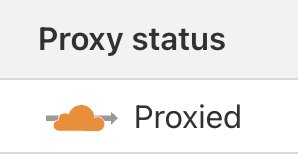
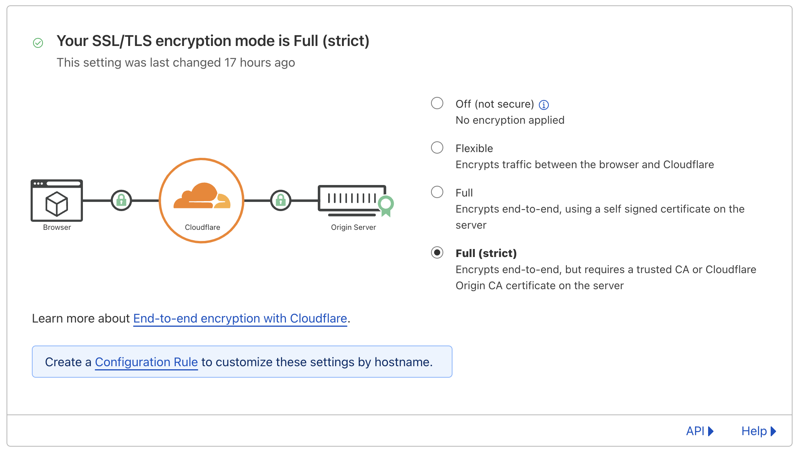
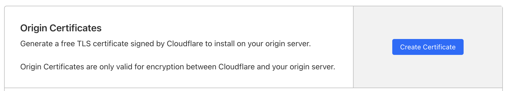
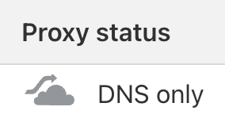
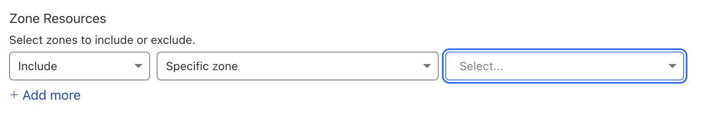

These blog posts are meant to document my journey as I learn and build things. Right now, I happen to be building my homelab with a storage server ([Nextcloud](https://nextcloud.com/)), and a media server ([Emby](https://emby.media)). I want to expose both of these to the internet so that I can access them from anywhere and share them with friends and family. To do this, I want different services to be accessible from different domain names. For example, `domain1.com` should point to the Nextcloud instance, and `domain2.com` should point to the Emby instance. The obvious way to do this is to configure the DNS so that each subdomain points to the IP address of the service. Unfortunately, since all of the services are running on a network behind the same public IP address, that won't work. The solution to this is to use a reverse proxy which will look at the `Host` header of the HTTP request and route the request to the correct service on my internal network. This also has the added benefit of simplifying the process of setting up SSL certificates, since I only have to install them on the reverse proxy, and not all of the services. I'm going to *try* to use Nginx for this, but we'll see if I change my mind halfway through this post (I'm writing this as I go).

Anyway, enough talk. Let's get started.

# What to run it on?

Thinking about the architecture of my internal network, I want this reverse proxy to run on something that I don't need to reboot. Sure, I could run it on one of the machines where I am hosting my other services, but if I need to reboot that machine for some reason, then the reverse proxy will go down too. I want this to stay up even if other machines or services go down. For this reason, I'm going to dedicate my Raspberry Pi 4 to this task. It's a small, low-power machine that I can just leave on all the time. To set it up, I simply installed Raspbian OS Lite (64-bit) on it using the official [Rasperry Pi imager](https://www.raspberrypi.com/software/). This OS is perfect because it's basically just the latest version of Debian without a desktop environment, which makes it pretty light. On the Raspberry Pi, I'll also run [Docker](https://www.docker.com/). To keep it simple, I'll just run all of my containers with Docker Compose. That way, all the config files will be in one place, and I can back them up easily.

# Setting up Docker and Nginx

Setting up Docker on Raspbian is pretty easy. I just followed the instructions [here](https://docs.docker.com/engine/install/debian/). That installs Docker and the Docker Compose plugin. Then I proceeded to set up some structure for my containers. I started by creating a directory `containers` which will house the configuration and data for all of the containers.

```bash
mkdir containers
```

Then for each container, create a subdirectory.

```bash
mkdir containers/nginx
```

To set up Nginx, I yoinked a `docker-compose.yml` file from [linuxserver.io](https://docs.linuxserver.io/images/docker-nginx/) and saved it to my `containers/nginx` directory. The only modification you need to do to this file is to set the path on the host machine for the config directory. I simply created a `config` directory in `containers/nginx`, and set the path to `./config` in the `docker-compose.yml` file. In the end, the file looked like this:

```yaml
---
version: "2.1"
services:
  nginx:
    image: lscr.io/linuxserver/nginx:latest
    container_name: nginx
    environment:
      - PUID=1000
      - PGID=1000
      - TZ=Etc/UTC
    volumes:
      - ./config:/config
    ports:
      - 80:80
      - 443:443
    restart: unless-stopped
```

Without doing anything else (including setting up any of the Nginx config files in the `config` directory), I ran `docker compose up`. Nginx started up, populated the `config` directory with some default config files, and I was able to access the default Nginx page from my browser. So far so good.

# A quick test

Admittedly, going into this, I had never used Nginx before. It's been one of those things that I've encountered a couple of times, tinkered with some config files, and then moved on. So the first thing I did was to set up a simple test. After watching a couple of videos on Youtube and consulting ChatGPT, I did the following.

I duplicated the `config/nginx/site-confs/default.conf` file and renamed it to `config/nginx/site-confs/emby.conf`. At this point, it looked like this:

```nginx
## Version 2023/04/13 - Changelog: https://github.com/linuxserver/docker-baseimage-alpine-nginx/commits/master/root/defaults/nginx/site-confs/default.conf.sample

server {
    listen 80 default_server;
    listen [::]:80 default_server;

    listen 443 ssl http2 default_server;
    listen [::]:443 ssl http2 default_server;

    server_name _;

    include /config/nginx/ssl.conf;

    set $root /app/www/public;
    if (!-d /app/www/public) {
        set $root /config/www;
    }
    root $root;
    index index.html index.htm index.php;

    location / {
        # enable for basic auth
        #auth_basic "Restricted";
        #auth_basic_user_file /config/nginx/.htpasswd;

        try_files $uri $uri/ /index.html /index.php$is_args$args =404;
    }

    location ~ ^(.+\.php)(.*)$ {
        fastcgi_split_path_info ^(.+\.php)(.*)$;
        fastcgi_pass 127.0.0.1:9000;
        fastcgi_index index.php;
        include /etc/nginx/fastcgi_params;
    }

    # deny access to .htaccess/.htpasswd files
    location ~ /\.ht {
        deny all;
    }
}
```

Then inside that file, I changed a few things: 

- I changed the `server_name` to `domain1.com`.
- I changed the `location /` block to only contain `proxy_pass http://<ip-of-my-service>`. 
- I deleted the `root` and `index` directives, along with all other `location` blocks since I'm not serving any static content.
- I deleted `default_server` from the `listen` directives. This is important because if multiple "servers" have the `default_server` flag, then Nginx will complain that there are multiple default servers.

The end result looks like this:

```nginx
## Version 2023/04/13 - Changelog: https://github.com/linuxserver/docker-baseimage-alpine-nginx/commits/master/root/defaults/nginx/site-confs/default.conf.sample

server {
    listen 80;
    listen [::]:80;

    listen 443 ssl http2;
    listen [::]:443 ssl http2;

    server_name domain1.com;

    include /config/nginx/ssl.conf;

    location / {
        proxy_pass http://<ip-of-my-service>;
    }
}
```

I did the same duplication/modification of the site config file for Nextcloud and restarted the Nginx container. It started up with no errors. Yay!

Now I needed to test it. Since I hadn't set up local DNS on my network, I just edited the `/etc/hosts` file and added the following line:

```text
<ip-address-of-raspberry-pi>  domain1.com domain2.com
```

Voila! When typing the domains that I configured into my browser, I was greeted with the login pages for Emby and Nextcloud. We're getting somewhere now!

# Setting up SSL certificates

Since I verified that I had the reverse proxy correctly routing requests to my various services, it was time to set up SSL certificates. With Let's Encrypt, there's no excuse not to have your sites secured with SSL. Now, you might think that I'm going to show you how to automate certificate management with Let's Encrypt, but you'd be wrong! I have another trick up my sleeve! (that I just discovered) 

I'm using [Cloudflare](https://cloudflare.com) to manage my DNS, and I'm using their proxy feature that proxies requests to your server through their servers. I simply created a DNS entry that pointed to my public IP address and made sure to enable the proxy feature.



The nice thing about using this feature is that Cloudflare will provision an SSL certificate for your domain. This is cool, but we still need to secure the network traffic between Cloudflare's servers and our server. 

Well, technically we don't *need* to. Cloudflare has the following options:



In my opinion, anything less than "Full (Strict)" isn't secure enough. Since "Full" allows for a self-signed certificate, it's technically possible for an attacker to redirect traffic to their own server and present a self-signed certificate of their own. Users would be none the wiser. So, "Full (Strict)" it is.

For this to work, we'll need to do a little bit of extra setup. We need some kind of certificate that Cloudflare can trust. That can either be a certificate signed by a standard certificate authority or by Cloudflare themself. We'll go with the latter since that's the easier option. While in the settings for a domain, in the left pane under the "SSL/TLS" category, click on the tab that says "Origin Server." It will bring up a page with this option:



When you click "Create Certificate", it will walk you through the process of creating a certificate and a private key. From there, it's as simple as copying the certificate and the private key into `config/keys/cert.pem` and `config/keys/key.pem` respectively. The only thing that was left for me to do was to port-forward port 443 on my router to port 443 on the Raspberry Pi. And that's it! Going to the domain that I configured in my DNS brings me to an SSL-secured version of my Emby and Nextcloud instances. Great!

# But, it kinda sucks

...at least for the Emby server. The problem is that Emby streams large amounts of data in the form of audio/video. This isn't great for streaming through a remote proxy. It's especially bad because Cloudflare tries to cache some of the assets which probably screws things up a good bit too. Additionally, it seems that the proxy feature isn't meant to be used with any kind of content streaming. This is evident from a [forum post](https://community.cloudflare.com/t/streaming-video-content-over-cloudflare-limits/556937) and their [terms of service](https://www.cloudflare.com/service-specific-terms-application-services/#content-delivery-network-terms).

> Cloudflare reserves the right to disable or limit your access to or use of the CDN, or to limit your End Users’ access to certain of your resources through the CDN, if you use or are suspected of using the CDN without such Paid Services to serve video or a disproportionate percentage of pictures, audio files, or other large files. We will use reasonable efforts to provide you with notice of such action.

# I guess we're just gonna have to rawdog it



The performance implications and potential ToS violations are deal breakers for me. So my next question was: am I okay with the risk of exposing my IP address and services directly to the internet?

[LiveOverflow](https://www.youtube.com/@LiveOverflow) did a [video](https://www.youtube.com/watch?v=MS7WRuzNYDc) on the topic of exposing your public IP address, and he addressed the two main concerns around it: security and privacy. On the security side, he argues that trying to hide your IP is not a good security measure to begin with, since "security by obscurity" never solves the root security issue. Hackers are constantly scanning IPs to find devices running vulnerable services, so trying to hide your IP won't help you if you have a vulnerable router or service exposed to the internet. The best way to mitigate attacks is to make sure that the services and devices that are exposed are up to date with the latest security patches.

On the privacy side, my main concern was with the ability to geolocate using an IP. However, LiveOverflow points out that you can only get a general location from an IP (usually just city and state), and that's information that I post on my website anyway. So, I'm not too concerned about that either.

The only real problem is one that [Jeff Geerling](https://www.youtube.com/@JeffGeerling) addressed in a comment: DoS and DDoS attacks. At the moment, I don't *think* anyone has any reason to DoS or DDoS me, but that could change if I become more popular. If it becomes a problem, I'll get a new IP and find solutions to mitigate the attacks. I'll "cross that bridge when I get to it."

While I'm not *too* concerned about the security and privacy implications of exposing my IP address, I also don't want to plainly advertise it to everyone. For this reason, I've chosen to still use `domain1.com` and `domain2.com` in this article as aliases for the actual domains that I'm using. No, you don't need to know where I'm hosting my services (unless you're a member of my friends or family).

# Setting up SSL certificates (again)

The SSL certificates that we got from Cloudflare earlier aren't real certificates signed by any legitimate certificate authority (CA); they're signed and trusted exclusively by Cloudflare. This means that if a client device tries to visit our site directly (i.e. without going through Cloudflare's proxy), then they will receive an error from the browser saying that the certificate did not originate from a trusted CA. So, we have to get a real certificate from Let's Encrypt.

There are plenty of ways to configure a job to automatically renew and fetch certificates and install them into Nginx, but each one of these solutions requires a decent amount of setup and configuration. In search of the easiest way to do this, I stumbled upon [Caddy](https://caddyserver.com/), a newer, simpler reverse proxy. Without *any* additional configuration, Caddy automatically fetches and installs certificates for all of your domains. That's pretty sick. Additionally, its configuration file format (called the Caddyfile) is *way* simpler than that of Nginx. Here's my config:

```text
# Caddyfile

# Nextcloud configuration
domain1.com {
  # special remappings for Nextcloud
  redir /.well-known/carddav /remote.php/dav 301
  redir /.well-known/caldav /remote.php/dav 301

  # Nextcloud will complain if you don't have this
  header {
    Strict-Transport-Security "max-age=15552000"
  }

  reverse_proxy http://<nextcloud-service>
}

# Emby configuration
domain2.com {
  reverse_proxy http://<emby-service>
}
```

Caddy also has great [documentation](https://caddyserver.com/docs/caddyfile/concepts) for the Caddyfile.

Setting it up with Docker Compose was straight forward as well. I created the `Caddyfile` with my Caddy configuration, and three directories, `config`, `data`, and `site`. Then I used the following `docker-compose.yml` file:

```yml
version: "3.7"

services:
  caddy:
    image: caddy:2.7.5-alpine
    restart: unless-stopped
    cap_add:
      - NET_ADMIN
    ports:
      - "80:80"
      - "443:443"
      - "443:443/udp"
    volumes:
      - ./Caddyfile:/etc/caddy/Caddyfile
      - ./site:/srv
      - ./data:/data
      - ./config:/config
```

# Setting up dynamic DNS

Since I don't pay for a static IP, I need to have a mechanism that ensures that the DNS records for my domains always point to the correct IP address. Fortunately, I have a router running [pfSense](https://www.pfsense.org/) which has a built-in feature for automatically updating Cloudflare DNS records.

The first step is to generate an API token in Cloudflare that pfSense will use to authenticate. Go to the "Overview" tab in the settings for your domain, and scroll down to the "API" section. Click on "Get your API token." From there, you can create a new token with a specified template. Choose "Edit zone DNS" as the template. It will take you to another page with some configuration options. The only option you need to set is "Zone Resources". Make sure you have a zone resource that is set to `Include`, `Specific zone`, and the target domain.



From there, you can click "Continue to Summary", and then "Create Token." Save the token that it presents to you. You won't be able to see it again after you leave that page.

Now, in pfSense, go to "Services" -> "Dynamic DNS" and click "Add." Choose "Cloudflare" as the service type (not "Cloudflare (v6)"; that's for IPv6). If you're using a subdomain, enter the subdomain in the "Hostname" field. Otherwise, enter "@". Enter your domain name as well. For the "Username" field, copy and paste your "Zone ID" from the overview page for your domain in Cloudflare. For the "Password" field, paste the API token that you generated earlier. Click "Save". If everything works, you should see a green checkmark next to the dynamic DNS client that you just created.

# The end

That's it! I now have multiple services accessible from the internet under *one* IP address. Cool, huh? That is the magic of multiple domains and reverse proxies. I hope you learned something! I definitely did.

# Resources used in this project
- [Docker](https://www.docker.com/)
- [Nginx image from linuxserver.io](https://docs.linuxserver.io/images/docker-nginx/)
- [Caddy image](https://hub.docker.com/_/caddy)
- [Cloudflare](https://www.cloudflare.com/)
- [Raspberry Pi 4](https://www.raspberrypi.org/products/raspberry-pi-4-model-b/)
- [pfSense](https://www.pfsense.org/)